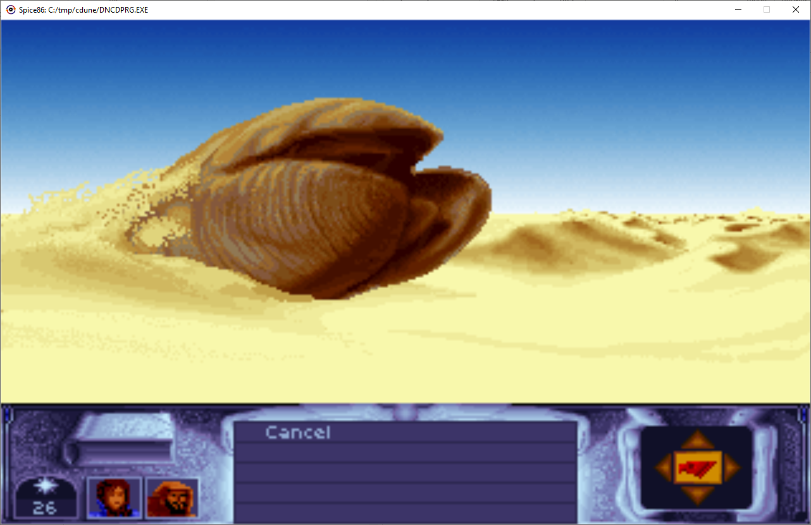
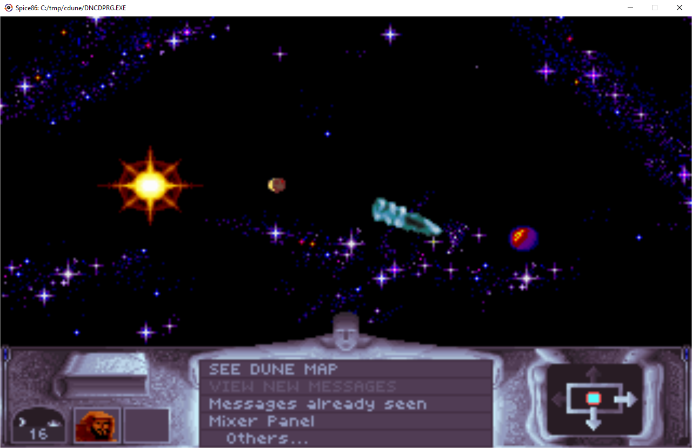

# Cryo dune reverse engineering

Fiddling with [Cryo dune](https://en.wikipedia.org/wiki/Dune_(video_game)) (CD Version) for fun:
 - Trying to understand how the game works with [spice86 reverse engineering toolkit](https://github.com/kevinferrare/spice86) which allows to run real mode x86 ASM / Java hybrids.
 - Rewriting the game in java bit by bit.

SHA256 signature of supported dncdprg.exe: 5f30aeb84d67cf2e053a83c09c2890f010f2e25ee877ebec58ea15c5b30cfff9

This projects requires [java 17](https://www.oracle.com/java/technologies/javase/jdk17-archive-downloads.html).

# Download
It's a bit confusing, but downloads are in the [package](https://github.com/kevinferrare?tab=packages&repo_name=cryodunere) section, not in the release section.

# Status
Thanks to the hybrid ASM / Java mode provided by [spice86](https://github.com/kevinferrare/spice86), the game is fully playable, but there is no sound (yet).

The goal is to have more and more logic written in human readable java.

# Running it
To run it, just run the jar with dune CD exe in parameter:

```
java -jar cryodunere-1.24.0.jar  C:/path/to/dunecd/DNCDPRG.EXE
```

# Building it
 - Download the code for [spice86](https://github.com/kevinferrare/spice86) and build it:

```
cd spice86
mvn clean install
```
 - Download the code for this project
 - Change spice86 version to 1.0-SNAPSHOT in the pom.

You need to change the version in the pom because spice86 is not published (yet?) to maven central, and github maven repository requires authentication even for download...

```xml
<dependency>
  <groupId>com.kevinferrare</groupId>
  <artifactId>spice86</artifactId>
  <version>1.0-SNAPSHOT</version>
</dependency>
```

 - Build it

```
cd cyrodunere
mvn clean install
```

The jar file will be in target folder






